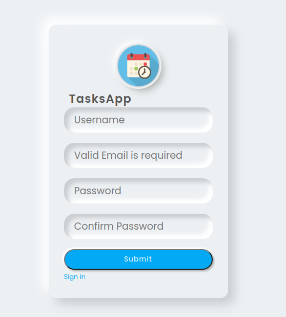
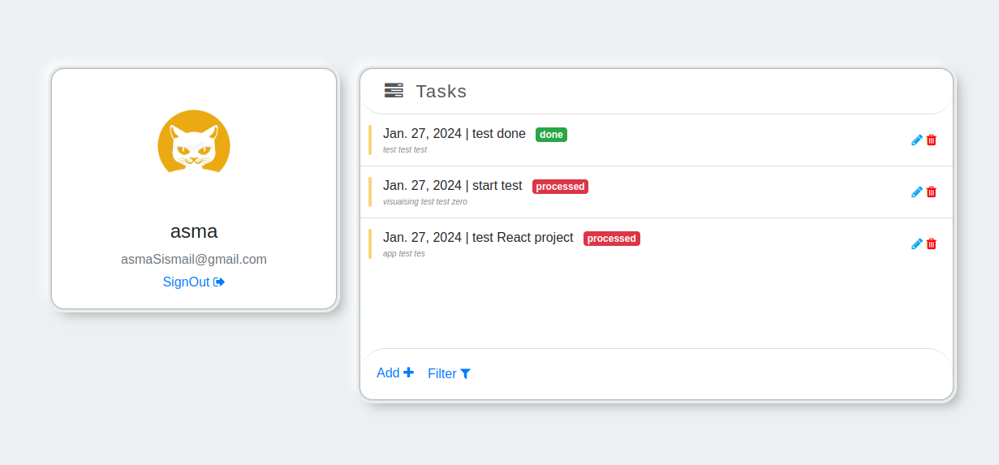

```markdown
# Django Todo List Application

## Features
- Create, update, and delete tasks
- Mark tasks as complete
- User authentication

## Prerequisites
- Python 3.x
- Django

## Installation
1. **Clone the repository:**
   ```bash
   git clone https://github.com/your-username/TodoListApp_Django.git
   ```

2. **Navigate to the project directory:**
   ```bash
   cd TodoListApp_Django
   ```

3. **Install dependencies:**
   ```bash
   pip install Django
   ```

4. **Usage:**
   - Run the development server:
     ```bash
     python manage.py runserver
     ```
   - Visit http://127.0.0.1:8000/ in your browser.

## Screenshots
**Registration Page**

       

**Home Page**

       
